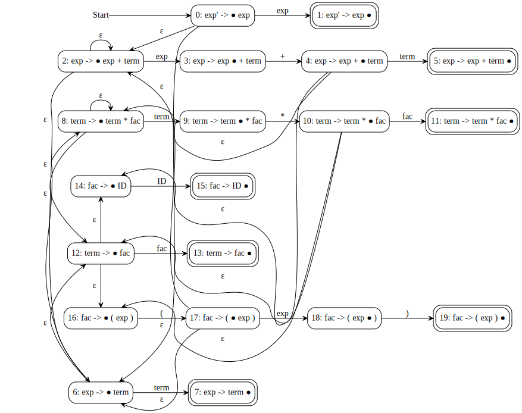
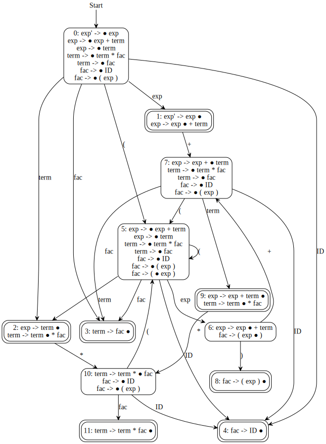

# LRParser

This is a grammar parser which can read grammar files in our format, analyze attributes (nullable, first set and follow set) of symbols, generate pushdown automatons and parse tables. It aims at learning/teaching LR parsing algorithms, and does not have the functionalities to actually translate languages to intermediate code.

## Output

For grammar:

```txt
exp   -> exp '+' term  | term
term  -> term '*' fac  | fac
fac   -> ID
fac   -> "(" exp ')'
```

and input:

```txt
ID * ID * ( ID + ID ) + ID $
```

the possible output is:

```txt
FolderName> build\lrparser.exe -g grammar.txt < input.txt
> Grammar rules has been parsed
Symbols:
    0) ε [TERM]
    1) $ [TERM]
    2) exp [NONTERM,START]
    3) + [TERM]
    4) term [NONTERM]
    5) * [TERM]
    6) fac [NONTERM]
    7) ID [TERM]
    8) ( [TERM]
    9) ) [TERM]
Productions:
    0) exp -> exp + term
    1) exp -> term
    2) term -> term * fac
    3) term -> fac
    4) fac -> ID
    5) fac -> ( exp )
> Calculate nullables
      Name   Nullable              First{}         Follow{}
  --------   --------             --------         --------
       exp      false                   {}               {}
      term      false                   {}               {}
       fac      false                   {}               {}
> Calculate first set
      Name   Nullable              First{}         Follow{}
  --------   --------             --------         --------
       exp      false             { ID ( }               {}
      term      false             { ID ( }               {}
       fac      false             { ID ( }               {}
> Calculate follow set
      Name   Nullable              First{}         Follow{}
  --------   --------             --------         --------
       exp      false             { ID ( }        { $ + ) }
      term      false             { ID ( }      { $ + * ) }
       fac      false             { ID ( }      { $ + * ) }
> NFA is built
> DFA is built
> Parse table
  States                        Actions                                            Gotos
--------                       --------                                         --------
         |       $ |       + |       * |      ID |       ( |       ) |   exp |  term |   fac
       0 |         |         |         |      s4 |      s5 |         |     1 |     2 |     3
       1 |     acc |      s7 |         |         |         |         |       |       |
       2 |      r1 |      r1 |     s10 |         |         |      r1 |       |       |
       3 |      r3 |      r3 |      r3 |         |         |      r3 |       |       |
       4 |      r4 |      r4 |      r4 |         |         |      r4 |       |       |
       5 |         |         |         |      s4 |      s5 |         |     6 |     2 |     3
       6 |         |      s7 |         |         |         |      s8 |       |       |
       7 |         |         |         |      s4 |      s5 |         |       |     9 |     3
       8 |      r5 |      r5 |      r5 |         |         |      r5 |       |       |
       9 |      r0 |      r0 |     s10 |         |         |      r0 |       |       |
      10 |         |         |         |      s4 |      s5 |         |       |       |    11
      11 |      r2 |      r2 |      r2 |         |         |      r2 |       |       |
> Summary: 12 states, 0 table cell conflicts.
> Please input symbols for test (Use '$' to end the input)
> Parser states
State stack : Bottom->| 0
Symbol stack: Bottom->|
Input queue : Front ->| ID,*,ID,*,(,ID,+,ID,),+,ID,$
[VERBOSE] Apply SHIFT rule
> Parser states
State stack : Bottom->| 0,4
Symbol stack: Bottom->| ID
Input queue : Front ->| *,ID,*,(,ID,+,ID,),+,ID,$
[VERBOSE] Apply REDUCE by production: 4
> Parser states
State stack : Bottom->| 0
Symbol stack: Bottom->|
Input queue : Front ->| fac,*,ID,*,(,ID,+,ID,),+,ID,$
[VERBOSE] Apply GOTO rule
> Parser states
State stack : Bottom->| 0,3
Symbol stack: Bottom->| fac
Input queue : Front ->| *,ID,*,(,ID,+,ID,),+,ID,$
[VERBOSE] Apply REDUCE by production: 3
> Parser states
State stack : Bottom->| 0
Symbol stack: Bottom->|
Input queue : Front ->| term,*,ID,*,(,ID,+,ID,),+,ID,$
[VERBOSE] Apply GOTO rule
> Parser states
State stack : Bottom->| 0,2
Symbol stack: Bottom->| term
Input queue : Front ->| *,ID,*,(,ID,+,ID,),+,ID,$
...
[VERBOSE] Apply GOTO rule
> Parser states
State stack : Bottom->| 0,1,7,9
Symbol stack: Bottom->| exp,+,term
Input queue : Front ->| $
[VERBOSE] Apply REDUCE by production: 0
> Parser states
State stack : Bottom->| 0
Symbol stack: Bottom->|
Input queue : Front ->| exp,$
[VERBOSE] Apply GOTO rule
> Parser states
State stack : Bottom->| 0,1
Symbol stack: Bottom->| exp
Input queue : Front ->| $
> Success
```

Automatons in graphviz language format are generated in result directory (default: results) because they are difficult to display in console. You need to invoke `dot` by yourself. The program used to provide generated `svg` files as well if you have `dot` installed, but invoking dot processes on Windows is too slow (in Linux it's just fast) and makes the tool a target of Windows Defender Anti-virus module because the tool invokes a lot of processes in such a short time. Later I tried to use graphviz as library in my code, but I found graphviz cgraph library had memory leaks and double free() bugs which I couldn't get right. So I dropped the support for directly generated svg files.

SLR NFA:



SLR DFA:



## Grammar format

Basic rules are as follows.

1. Supports comments using `!` , `%`or `#`. Those behave like `#` in Python.

   e.g.

   ```txt
   # This is a comment
   ! This is another comment
   exp -> term '+' exp1 % Yet another comment
   ```

2. `\epsilon`, `\e`, `_e` are reserved as aliases for epsilon.

3. `$` is reserved as end-of-input token.

4. **All C-language valid variable names are designed to be valid in this grammar**.

5. `'TOKEN'` and `"TOKEN"` can be used if `TOKEN` contains characters other than those allowed in C-language. e.g. `'"'` means `"` character, and `"'"` means `'` character. But nested quotes are not supported and spaces cannot appear in symbol names. 

6. You can use `\` to start a name. e.g. `\2345` and `\oops` are valid. Do not reply on this feature, because it's originally designed to support epsilon.

7. Define tokens as follows.

   ```txt
   TERM :{ID, '(', ')', '+', '*'}
   ```

   This can be used if you want to control the index order of tokens. You need to pass flag `--disable-auto-define` to make it happen. In most cases, you can just define productions directly.

8. Define productions as follows.

   ```txt
   exp   -> exp '+' term  | term
   term  -> term '*' fac
          | fac
   fac   -> ID
   fac   -> "(" exp ')'
   ```

   `exp`, `term` and `fac` are in 3 different forms. You can define productions of the same symbol in one line. You can also append producitons of the previous symbol by using another production definition like how I define productions of `fac`.

   There is no need to define non-terminals. Symbols in the left hand side of productions are defined as non-terminals automatically.

It's sad that we cannot use grammars in Bison format here. Its because Bison has a semicolon after each definition, while we just start a new line. If you want to edit a grammar file in Bison format to adapt our grammar format. You can:

   1. Remove semicolons. (You do not have to remove token definitions, because we've made `%` a comment starting token.)
   2. Make sure all symbols in the same produciton body stay in the same line.
   3. Pass argument `--body-start=":"` when launching the program. This argument makes the tool search for `:` instead of `->`. (Similarly, if you have production whose format is like `A ::= B a`, you can use `--body-start="::="`.)

## Usage

```bash
lrparser [[-h|--help]|[-t<Type>] [-g<Grammar file>] [-o<Result Dir>]] <FLAGS>

Possible command: lrparser -tslr -g grammar.txt -o results

Options:
-t        : Choose a parser type. Available: lr0, slr, lalr, lr1. (Default: slr)
-o        : Specify output directory. (Default: "results").
-g        : Specify grammar file path. (Default: "grammar.txt")
-h|--help : Output help message and then exit.

Flags:
--no-test : Just generate automatons and parse table. Do not test an input sequence. Program will finish as soon as the table is generated.
--body-start=<String>:
    Define the start of a production as the given <String>. The default is "->", but you may want "::=" or ":" if your grammar is written that way.
--strict  : Input token names must conform to rules of grammar file. Without this flag, they are simply space-splitted.
--debug   : Set output level to DEBUG.
--step    : Read <stdin> step by step. If you have to process a very large input file, you may need this flag. But without this flag the parser can provide better display for input queue.
--disable-auto-define: All terminals must be defined before being used.
```

## Build

```bash
git clone git@github.com:Simouse/lrparser.git
cd lrparser
mkdir build && cd build
cmake -G Ninja .. # Or "cmake .." if you do not have Ninja
cmake --build .
```

This tools have some parts relying on pthread library if you are on Linux, so you may have to install it. Windows platform does not have this requirement. (Multi-threading was used for `svg` output. The feature was dropped but utility functions stayed in code.)

## Resources

I found some resources really helpful in my learning. I compared my results with their programs' to detect my bugs and the reasons causing the bugs. I didn't use their code though.

[jsmachines](http://jsmachines.sourceforge.net/machines/) supports ll1/lr1/lalr/slr/turing, etc. It's lightweight and fast.

[Context Free Grammar Tool (ucalgary.ca)](http://smlweb.cpsc.ucalgary.ca/start.html) is a website providing colorful parse tables for grammars. It does not support very long grammar due to the length limit of URL.

[JFLAP](https://www.jflap.org/) is a powerful tool which I use quite often (at least these days).

## Q&As

### How to show `ε` correctly in console?

On Windows, you should change code page to 65001 to enable UTF-8. If you use VS Code, a plain `chcp 65001` does not seem to work. You could either modify system registry table (**NOT recommended**) or use console profiles.

### `#include <vcruntime.h>` causes compilation error.

Just remove those lines. My editor added those for me, but they are not needed. I often forget to delete those lines.

### Why is the grammar format and command line arguments so strange?

Well, one of my team projects needs this program and I have to provide support for it. For example, that project uses `!` as a divider between token definitions and production definitions, and I think that's unnecessary. So I just make `!` another comment sign. But `#` is more useful, because in editors you can associate your grammar file with `cmake` language,and then use `CTRL+/ `to comment lines.

### No use of Bison?

At first I thought I was writing (, not using) a LR parsing program, so I shouldn't use bison. But later I found the grammar rule parsing so difficult and tiring. I used a lot of branches, making my code really messy. So if I were to choose again, I definitely would use Bison in that part.